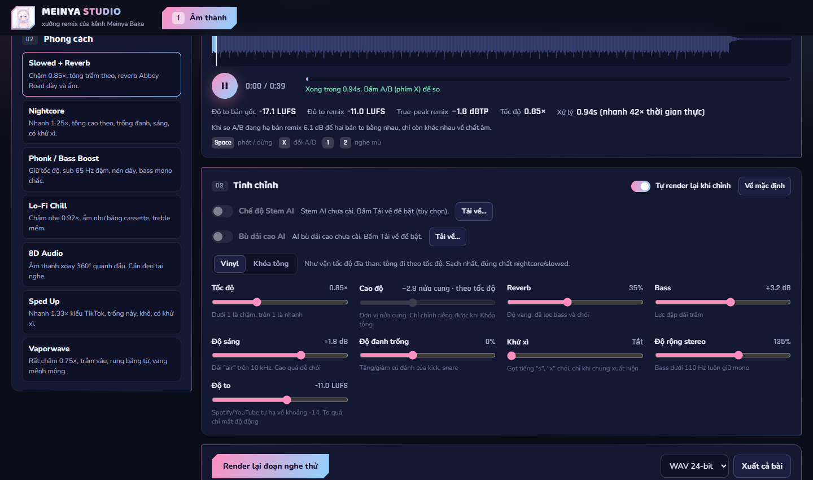
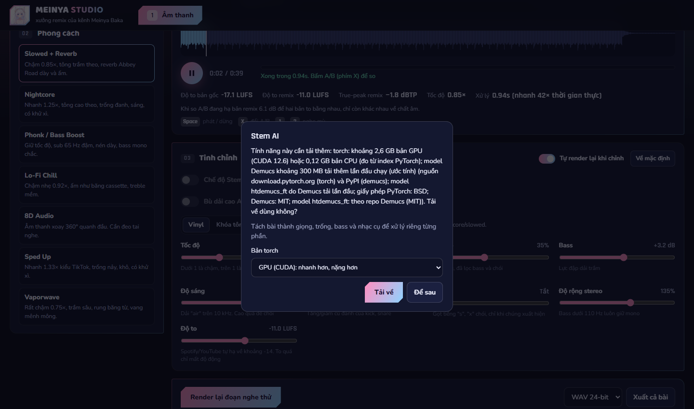

# Meinya Studio Remix

Xưởng remix âm thanh chạy trên máy bạn: kéo một bài hát vào, chọn phong cách (Nightcore, Slowed + Reverb, Sped Up, Vaporwave, Lo-Fi, Bass Boost, 8D), chỉnh vài núm rồi nghe thử hoặc xuất cả bài. Mọi xử lý chạy cục bộ, không gửi bài của bạn đi đâu.



> Repo này không kèm nhạc. Chỉ xử lý bài bạn có quyền dùng.

## Bắt đầu nhanh

1. Tải repo về (nút **Code → Download ZIP**) rồi giải nén vào một thư mục.
2. Bấm đúp **`run.bat`**. Lần đầu máy tự tạo `.venv` và cài thư viện lõi đã ghim (cần Python 3.11 trở lên từ python.org, nhớ tick *Add python.exe to PATH*).
3. Kéo một file nhạc vào ô **Bài hát**, chọn phong cách, bấm **Nghe thử 30 giây**, rồi **Xuất cả bài**.

Chạy lại sau này chỉ cần bấm `run.bat`: không cài lại gì.

## Tính năng

| Tính năng | Có sẵn | Tải khi cần (khi bạn bấm bật) |
|---|---|---|
| 7 phong cách, chỉnh tốc độ, tông, reverb, bass, độ sáng, đánh trống, khử xì, độ rộng | ✅ | |
| Nghe A/B, nghe mù, ghim bản remix, cân bằng âm lượng | ✅ | |
| Nạp WAV, FLAC, OGG, MP3, M4A, AAC, OPUS; xuất WAV 24-bit, FLAC | ✅ | |
| Xuất MP3 320k | | ffmpeg 8.0.1 cài bằng winget: khoảng 234 MB tải về, khoảng 616 MB sau khi cài |
| Tách stem AI (giọng, trống, bass, nhạc cụ) | | PyTorch + Demucs: khoảng 2,6 GB bản GPU hoặc 0,12 GB bản CPU, cộng model ~300 MB tải lần đầu (ước tính) |
| Bù dải cao AI (phục hồi phần MP3 bị cắt) | | PyTorch + mã và trọng số Apollo: thêm khoảng 66 MB |

Phần **Video & Xuất** (dựng video, đăng YouTube, tra tên bài bằng agy) là phần riêng của kênh, không có trong bản này: app tự ẩn các phần đó.

### Hộp thoại "Tải về"

Bấm bật Stem AI, Bù dải cao AI hoặc Xuất MP3 khi thiếu thư viện thì app hiện hộp thoại: tính năng này tải gì, khoảng bao nhiêu, từ đâu, giấy phép gì. Bạn chọn **Tải về** hoặc **Để sau**.

- Chỉ tải từ nguồn chính thức (PyPI, download.pytorch.org, GitHub và Hugging Face của tác giả), đúng phiên bản đã ghim.
- File tải về ghi vào file tạm, kiểm SHA-256, khớp rồi mới đổi tên. Không chạy mã tải về trước khi kiểm.
- Thư viện cài vào `.venv` của app, không đụng Python hệ thống.
- Tải lỗi thì tính năng vẫn tắt, app vẫn chạy bình thường; hộp thoại nói rõ lỗi.



## Yêu cầu

- Windows 10 hoặc 11 (đã thử trên Windows 11, Python 3.13).
- Python 3.11 trở lên (tải từ python.org).
- Card NVIDIA không bắt buộc. Không có GPU thì Stem AI vẫn chạy trên CPU, chậm hơn nhiều.
- ffmpeg không bắt buộc. Thiếu thì không xuất được MP3; WAV, FLAC, OGG vẫn xuất bình thường.

## Dòng lệnh (không cần giao diện)

Sau khi `run.bat` đã tạo `.venv`:

```bat
.venv\Scripts\python.exe remix_cli.py --list
.venv\Scripts\python.exe remix_cli.py "bai_hat.mp3" --preset slowed_reverb --output "out\bai_hat_slowed.wav"
.venv\Scripts\python.exe remix_cli.py "bai_hat.mp3" --preset nightcore -f mp3 --bitrate 320k --output "out\bai_hat_nightcore.mp3"
.venv\Scripts\python.exe remix_cli.py "thu_muc_nhac" --preset vaporwave --output "out\"
```

Tuỳ chỉnh thêm: `--speed 0.9`, `--pitch -2` (đặt `--pitch` sẽ chuyển sang chế độ khóa tông, tốc độ và tông tách rời), `--reverb 0.35`, `--bass 3`. Cờ `--stems` và `--restore` cần tính năng đã được cài trong app (bấm **Tải về** ở giao diện); chưa cài thì lệnh báo và bỏ qua bước đó.

## Preset

| Mã (`--preset`) | Tên | Đặc tính |
|---|---|---|
| `slowed_reverb` | Slowed + Reverb | Chậm 0.85×, reverb sâu, ducking để giữ trống và giọng |
| `nightcore` | Nightcore | Nhanh 1.25×, kick đanh, bass bù lại |
| `sped_up` | Sped Up | Nhanh 1.33×, transient trống rõ |
| `bass_boost` | Drift Phonk & Bass | Bass mạnh, nén sidechain, sub giữ mono |
| `lofi_chill` | Lo-Fi | Chậm 0.92×, dải cao mềm, tape flutter |
| `spatial_8d` | 8D | Âm thanh xoay quanh đầu, bass giữ ở giữa |
| `vaporwave` | Vaporwave | Chậm 0.75×, wow và flutter, reverb trung tâm thương mại |

Thêm preset: tạo file trong `presets/`, kế thừa `RemixPreset` rồi đăng ký trong `presets/registry.py`.

## Khôi phục âm thanh (Apollo)

Nhiều bài trên YouTube là MP3 128k: codec đã cắt mất phần trên khoảng 16 kHz. Bù dải cao AI chỉ thêm lại phần bị cắt, phần còn lại của bài giữ nguyên. Nguồn đủ dải thì app tự bỏ qua.

Khi bật, app cài và kiểm từng thành phần: thư viện PyTorch, mã model Apollo lấy từ github.com/JusperLee/Apollo ở commit đã ghim (kiểm SHA-256 từng file), và trọng số `pytorch_model.bin` từ huggingface.co/JusperLee/Apollo (SHA-256 `99d9af7f…e8d76`). Repo này không kèm mã và trọng số đó.

## Test

```bat
.venv\Scripts\python.exe -X utf8 -m unittest tests.test_engine tests.test_features tests.test_web_features -v
```

`test_15` tự bỏ qua nếu chưa cài Demucs.

## Thư viện và giấy phép

Mã của repo: **GPL-3.0**, xem [LICENSE](LICENSE). Lý do: thư viện `pedalboard` (reverb và nén) có giấy phép GPLv3, nên repo dùng GPL-3.0 để khớp với nó.

Thư viện cài sẵn khi chạy `run.bat`:

| Thư viện | Phiên bản | Giấy phép |
|---|---|---|
| numpy | 2.2.6 | BSD |
| scipy | 1.17.1 | BSD |
| soundfile | 0.14.0 | BSD-3-Clause |
| pyloudnorm | 0.2.0 | MIT |
| pedalboard | 0.9.25 | GPLv3 |

Thư viện và mã tải khi bạn bật tính năng:

| Thành phần | Giấy phép |
|---|---|
| PyTorch (torch) 2.13.0 | BSD |
| Demucs 4.1.0 và model htdemucs_ft | MIT |
| omegaconf 2.3.1 | BSD-3-Clause |
| huggingface_hub 1.14.0 | Apache-2.0 |
| Mã Apollo và trọng số | CC BY-SA 4.0 (ghi trên repo gốc và trang model Hugging Face) |
| ffmpeg 8.0.1 (gói Gyan.FFmpeg của winget, bản full) | GPL-3.0, xem ffmpeg.org/legal.html |

Các thành phần tải về giữ giấy phép riêng của chúng; repo này không cấp lại.

## Tên và hình Meinya

Tên "Meinya", logo và màu sắc của Meinya Studio là của tác giả (Elainabaka). Giấy phép GPL-3.0 chỉ áp dụng cho mã nguồn, không áp dụng cho tên và hình này. Nếu bạn phân phối bản sửa đổi, hãy đổi tên và logo trước.

---

## English

Local audio remix studio in Python (Windows). Drop a track in, pick a style (Nightcore, Slowed + Reverb, Sped Up, Vaporwave, Lo-Fi, Bass Boost, 8D), tweak a few knobs, then preview or export. Everything runs on your machine.

**Quick start:** download the ZIP, double-click `run.bat` (first run creates `.venv` and installs the pinned core libraries; Python 3.11+ needed), then drop a file in the app.

**Downloaded only when you turn a feature on:** stem separation (PyTorch + Demucs), high-band restoration (Apollo code and weights, SHA-256 checked), and ffmpeg for MP3 export. The app asks first and shows what, how big, from where and under which license. Downloads are checked before use; a failed download turns that feature off and the rest keeps working.

The repo contains no music. The name and logo "Meinya" belong to the author and are not covered by the GPL-3.0 license of the code. License: GPL-3.0 (because of `pedalboard`).
